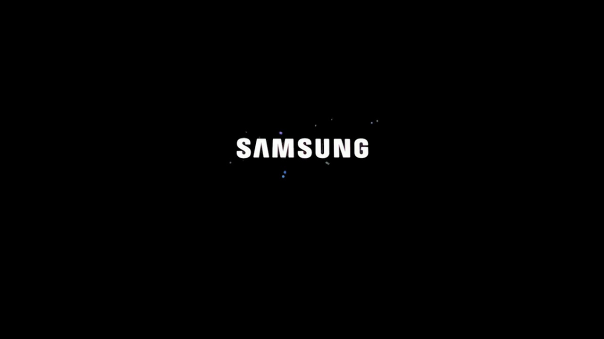

### _Simple packing solution for those who like to tinker with BootAnimations on Samsung devices_

# Usage
### Put 3 qmgs to Bootanimation folder

# If Windows 
- Double click on make.bat

# If Linux
- run `chmod a+x make.sh && bash make.sh`

## What script does?

- It simply renames 
- `boot.qmg` to `bootsamsung.qmg`
- `loop.qmg` to `bootsamsungloop.qmg`
- `shut.qmg` to `shutdown.qmg`

### Then

- It moves those renamed qmgs to its respective folder
- And lastly it makes flashable zip out of it by the name of `KKRT_BootAnim_720x2018.zip`

# Credits
### - @MrWaehere for his script and work with [CRB kitchen.](https://forum.xda-developers.com/t/tool-windows-kitchen-crb-v3-0-0-beta14.3947779/)
### - @sexynos300 for Editing Banner and logos.
